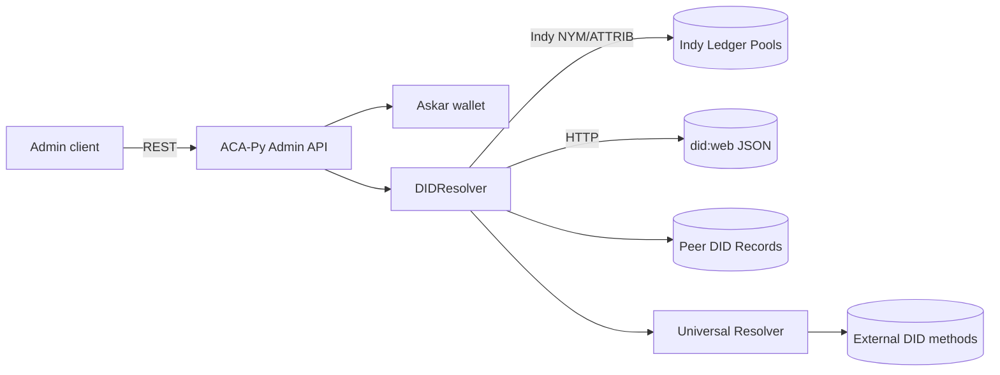
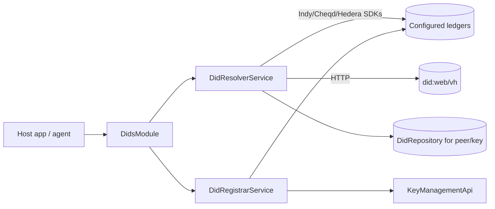
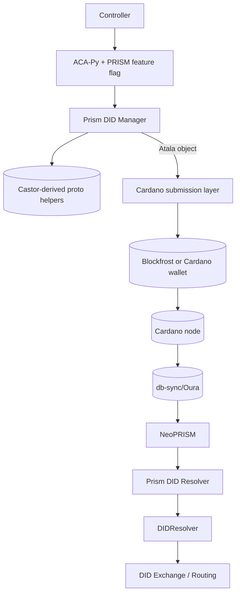
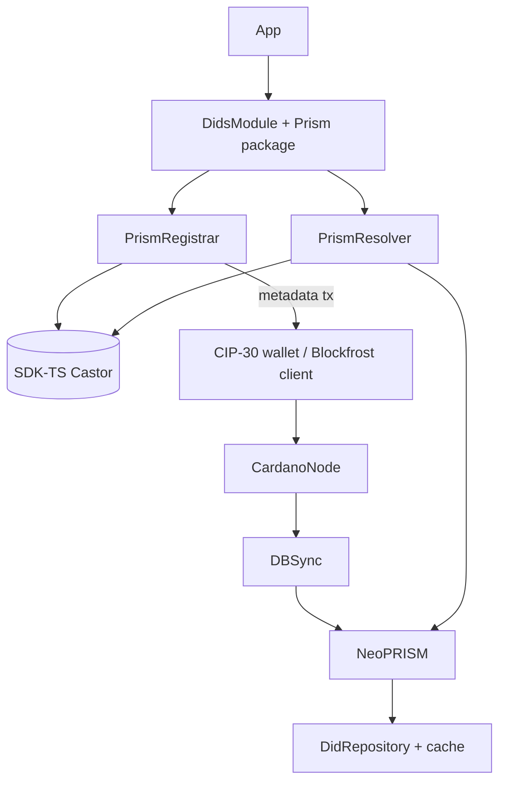
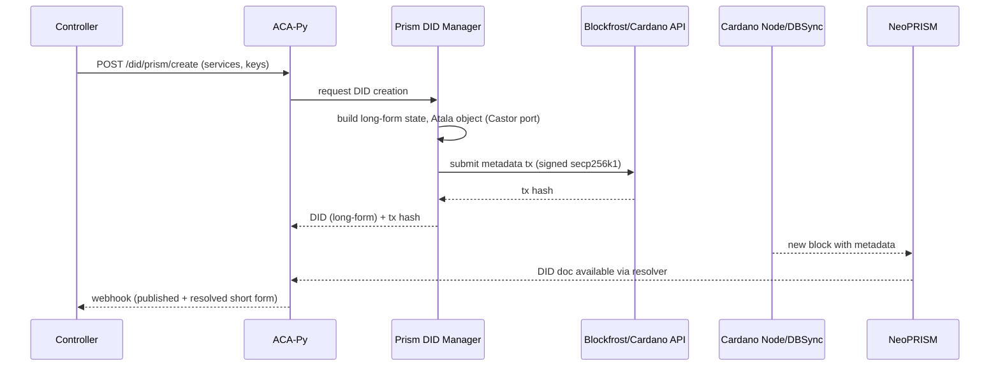
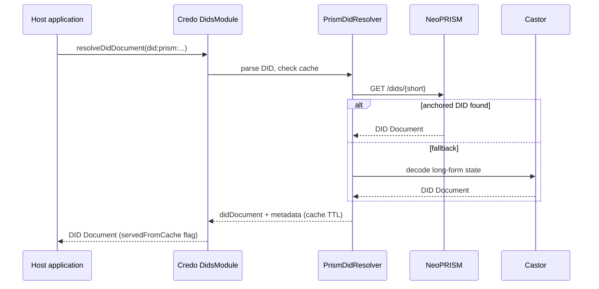

# Infrastructure & architecture

## Required infrastructure components

| Component | Purpose | Source / reference |
| --- | --- | --- |
| **NeoPRISM node** | Indexes PRISM operations, exposes universal-resolver compatible API, optionally submits operations when run in submitter/standalone mode. Supports DBSync/Oura data sources and PostgreSQL state (`neoprism/README.md:18-68`). | Deployed per environment; can run behind a gateway as shown in the Blockfrost demo (`neoprism/docker/blockfrost-neoprism-demo/README.md:83-155`). |
| **Cardano data pipeline** | Cardano node (relay or local) + `cardano-wallet` + `db-sync` or third-party provider. Ensures DID operations can be published and later indexed. | Blockfrost + NeoPRISM demo illustrates how DBSync feeds both Blockfrost Ryo and NeoPRISM (`neoprism/docker/blockfrost-neoprism-demo/README.md:83-155`). |
| **Transaction submission API** | Either Blockfrost, Mesh SDK (client-side CIP30) or custom cardano-serialization-lib stack to post metadata with Atala objects (`sdk-ts/docs/prism/publishing-did.md:6-190`). | Needed for both ACA-Py (server-side) and Credo (edge agents). |
| **SDK-TS Castor (or port)** | Encodes/decodes long-form DIDs and generates protobuf operations (`sdk-ts/src/castor/Castor.ts:42-220`). | Serves as reference implementation for other languages. |
| **Universal resolver / HTTP proxy** | Optional front door so agents can consume PRISM DIDs before native resolvers ship. ACA-Py already ships an HTTP adapter (`acapy/acapy_agent/resolver/default/universal.py:31-126`). | Can front NeoPRISM or other hosted resolvers.

## Current-state architectures

### ACA-Py today

### Credo-TS today

## Future-state with `did:prism`

### ACA-Py + PRISM

### Credo-TS + PRISM

Both diagrams explicitly include Blockfrost API, Cardano node, wallet, db-sync, and NeoPRISM per the integration expectations.

## Sequence diagrams

### Publishing a PRISM DID from ACA-Py

### Resolving a PRISM DID in Credo-TS

These flows illustrate how Blockfrost, Cardano nodes, db-sync, and NeoPRISM cooperate with the agents and their new components.
